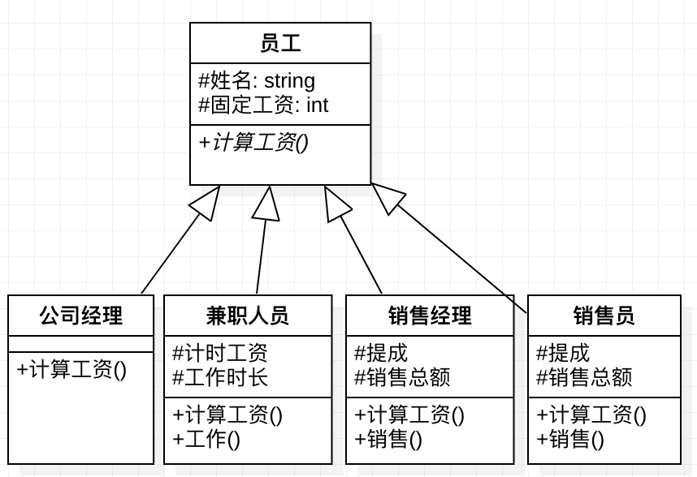

## Assignment

下面是某公司经理、兼职人员、销售经理和销售员的工资计算方法，设计合适的基类和派生类，实现这一工资管理任务。

| 人员类别 | 固定工资/元 | 计时工资/(元/小时) | 当月销售总额提成 |
|----------|-------------|--------------------|------------------|
| 公司经理 | 8000        | 无                 | 无               |
| 兼职人员 | 无          | 100                | 无               |
| 销售经理 | 5000        | 无                 | 5‰               |
| 销售员   | 无          | 无                 | 4%               |

